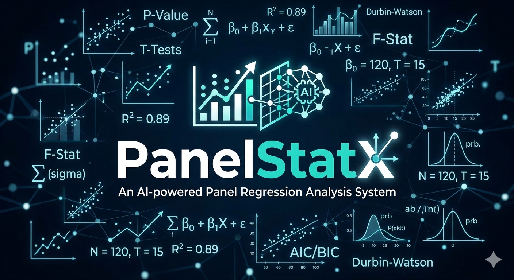

# ⬡ PanelStatX

  

PanelStatX is an AI-powered panel regression system that analyses panel data and produce clear, credible and publish ready reports

PanelStatX is a browser-based panel data analysis platform built for economists, researchers, analysts, and data professionals who need rigorous panel regression without the friction of Python scripts, R packages, or heavyweight statistical software. It combines institutional-grade econometric methods with an AI-powered explainer.
- No statistics degree required.
- No complex setup.
- Just upload your data, run your model, and get results you can actually understand
---

## What Is Panel Data Analysis?

Panel data (also called longitudinal data) tracks multiple entities across time. This data can come from:
- Companies
- Countries
- Individuals 

PanelStatX accepts these kinds of data as CSV and Excel files. For analysis, panel dataset should be structured in **long format** as one row per entity-period observation.

**Example of the acceptable data structure format:**

| entity | year | gdp_growth | investment | trade_openness |
|--------|------|------------|------------|----------------|
| Europe | 2015 | 2.7 | 18.3 | 0.34 |
| Europe | 2016 | -1.6 | 15.1 | 0.29 |
| Africa | 2015 | 3.8 | 22.0 | 0.51 |
| ... | ... | ... | ... | ... |

- The **entity column** identifies cross-sectional units (e.g. country, firm, individual)
- The **time column** identifies the period (e.g. year, quarter)
- All other numeric columns can serve as dependent or independent variables

---

## Key Features
Analysing panel data correctly requires specialised estimators that account for hidden differences between entities and time trends. PanelStatX handles all of this for you automatically. The system is designed and engineered to support the following

-	Regression Models
	- **Pooled OLS** — a standard regression baseline treating all observations equally
	- **Fixed Effects (Two-Way)** — controls for both entity-specific and time-specific unobserved heterogeneity via within-group demeaning
	- **Random Effects (GLS)** — a Swamy-Arora variance-components estimator with quasi-demeaning; appropriate when entity effects are uncorrelated with regressors

### Statistical Diagnostics
- Coefficient table with standard errors, t-statistics, p-values, and significance stars (`***`, `**`, `*`)
- Full model fit statistics: R², Adjusted R², AIC, BIC, F-statistic
- **Hausman Test** — automatically guides you toward Fixed vs Random Effects
- **Jarque-Bera Test** — checks normality of residuals
- **Durbin-Watson Statistic** — detects autocorrelation in residuals
- **Breusch-Pagan Test** — tests for heteroskedasticity
- Residual distribution plots, Q-Q plots, fitted vs actual scatter, and leverage analysis

### AI Explainer (GPT-4)
- One-click narrative interpretation of your full regression output
- Covers model choice rationale, coefficient economic meaning, statistical significance, model fit quality, and caveats (endogeneity, heteroskedasticity, etc.)
- Ask custom follow-up questions directly — e.g. *"Is x1 economically significant?"*

### Visualisations
- Interactive Plotly charts throughout — time-series lines by entity, entity mean bar charts, residual diagnostics, correlation heatmaps, distribution plots
- All charts are dark-themed and render inline — no export needed to share insights at a glance

### Downloadable Report
- One-click **Word (.docx) report** containing:
  - Cover page with model metadata
  - Model summary and fit statistics table
  - Full coefficient estimates table (with significance highlighting)
  - Residual diagnostics table with auto-generated interpretations
  - AI write-up section (if generated before download)

### Demo Mode
- Built-in synthetic balanced panel dataset (30 entities × 10 periods) — try every feature immediately with no data required

---

## Why PanelStatX?

| | PanelStatX | Stata / EViews | R (`plm`) | Excel |
|---|---|---|---|---|
| Runs in the browser | ✅ | ❌ | ❌ | ✅ |
| No installation | ✅ | ❌ | ❌ | ✅ |
| Fixed + Random Effects | ✅ | ✅ | ✅ | ❌ |
| Hausman Test | ✅ | ✅ | ✅ | ❌ |
| Breusch-Pagan Test | ✅ | ✅ | ✅ | ❌ |
| AI plain-language explanation | ✅ | ❌ | ❌ | ❌ |
| Downloadable Word report | ✅ | ❌ | ❌ | ❌ |
| No code required | ✅ | ❌ | ❌ | ✅ |
| Pay-per-analysis (no subscription) | ✅ | ❌ | ✅ | ✅ |

PanelStatX is designed to be the fastest path from raw panel data to a presentation-ready, defensible analysis — whether you're a PhD researcher, a policy analyst, or an analyst building models for a client.

---

## Credits & Access

PanelStatX operates on a **prepaid credit system**. Each analysis run costs 1 credit. Explanation of Results using AI also cost 1 credit

- Credits are tied to your unique **access key (PSX-xxxx-xxxx-xxx)** , issued at purchase
- **Credits are tied to your email and purchased key. It never expire** — use them at your own pace, on your own schedule, from anywhere in the world
- There are no subscriptions, no monthly fees, and no usage windows to worry about
- Your key works from any device and any browser — no account login required

To get started, enter your purchased **access key** on the landing page. Your remaining credit balance is shown in the sidebar at all times. You can top it up anytime

---

## Getting Started (End Users)

1. **Get an access key** — purchase credits to receive your key
2. **Visit the app** and enter your key on the landing screen
3. **Upload your dataset** — CSV or Excel files with columns for your entity ID, time period, dependent variable, and independent variables
4. **Configure your model** in the sidebar — select columns, choose estimator, set options
5. **Run Analysis** — results appear instantly across five tabs
6. **Explore** — check diagnostics, visualise entity trends, ask the AI explainer questions
7. **Download** your Word report when ready

**No software to install. No command line. No code. Very easy to use**

---

---

## Econometric Methods Reference

| Estimator | Handles Entity FE | Handles Time FE | Intercept | Notes |
|-----------|:-----------------:|:---------------:|:---------:|-------|
| Pooled OLS | ❌ | ❌ | ✅ | Baseline; inconsistent if FE present |
| Fixed Effects (Two-Way) | ✅ | ✅ | ❌ | Within-estimator via double demeaning |
| Random Effects (GLS) | ✅ (partial) | ❌ | ✅ | Swamy-Arora; efficient under RE assumptions |

**Hausman Test guidance:**
- Reject H₀ (p < 0.05) → use Fixed Effects
- Fail to reject H₀ → Random Effects is consistent and more efficient

---

## Support

For access key issues, credit top-ups, or technical questions, contact the PanelStatX team directly. Include your access key (first 4 characters only) and a description of the issue.

---

*⬡ PanelStatX · Panel Regression Analysis System · Powered by GPT-4*