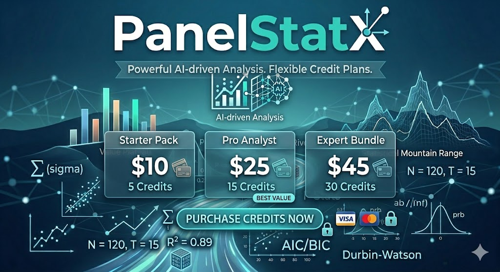

# ⬡ PanelStatX

  

PanelStatX is a web-based AI-powered panel regression analysis system. It is built as a no-code statistical analysis system for economists, researchers, students, analysts, and data professionals who need to carry out rigorous panel regression.

PanelStatX stands out for its:
-	Simplicity: No complex installation or set up is required
-	Accessibility: It can be accessed and used via Android/iOS mobile phones, laptop and desktop devices
-	User Friendliness: It is purely a no-code system with a very low steep learning curve. It eliminates friction of writing compex Python scripts, R packages, or mastering use of heavyweight statistical software for panel regression
-	Hybrid Performance: It combines institutional-grade econometric methods with an AI-powered explainer.
-	Intelligence: It uses Large Language Model (GPT-4o) as a intelligent layer to explain results for users with no statistical background

---

## Key Features
Analysing panel data correctly requires specialised estimators that account for hidden differences between entities and time trends.
 
PanelStatX automatically handles these complexities, enabling users to focus on interpretation rather than implementation. 

The system is designed and equipped with:
-	Core Regression Models
	- 📈Pooled OLS
	- 🏢Fixed Effects
	- 🔄Fixed Effects (Two-Way)
	- ⚙️Random Effects (GLS)
	- 📉First Difference

-	Statistical Diagnostics
	-📋 Coefficient Summary Table covering standard errors, t-statistics, p-values, and significance stars (`***`, `**`, `*`)
	- 📐Model Fit Metrics: covering R², Adjusted R², AIC, BIC, and F-statistic for evaluating model performance
	- 🧪 Model Diagnostic including:
		- ⚖️Hausman Test
		- 🔔Jarque-Bera Test:
		- 🔁Durbin-Watson Statistic
		- 📉Breusch-Pagan Test
	
	
-	🤖 AI Explainer Powered by OpenAI’s **GPT-4o**: System supports one one-click clear nterpretation in terms:
		-	Model choice rationale
		-	Coefficient interpretation (B-coefficient)
		-	Statistical significance (p-values)
		-	Model fit quality
		-	Key caveats (e.g., endogeneity, heteroskedasticity)

-	📊Visualisations: System produce interactive charts that include 
	- 	Time-series trends by entity
	-	Entity-level comparison bar charts
	-	Correlation heatmaps
	-	Residual Distribution Plots for understanding error distribution and detect deviations from normality.
	-	Q-Q Plots that visually assess whether residuals follow a theoretical normal distribution.
	-	Fitted vs Actual Scatter plots that evaluate model performance by comparing predicted vs actual values.

-	Downloadable Report **Word (.docx) report** containing:
	- Model summary and fit statistics table
	- Full coefficient estimates table (with significance highlighting)
	- Residual diagnostics table with auto-generated interpretations
	- AI write-up section 

---
## Workflow
**To use PanelStatX, no software installation is needed, No command line is needed. No code is required. Very easy and direct under 5 minutes based on key 7 steps**

1. **Get an access key** — purchase credits to receive your unique key
2. **Visit the app** and enter your key on the landing screen. Your remaining credit balance is shown in the sidebar at all times. You can top it up anytime
3. **Upload your panel dataset** in the side bar — CSV or Excel files with columns for your entity ID, time period, dependent variable, and independent variables
4. **Configure your model** in the sidebar — select columns, choose estimator, set options
5. **Run Analysis** — results appear instantly across five tabs
6. **Explore** — check diagnostics, visualise entity trends, ask the AI explainer questions
7. **Download** your Word report when ready

👉 **[Try the Live System Here](https://achievit.streamlit.app/)**

---
## Pricing

  

*⬡ PanelStatX · Panel Regression Analysis System · Powered by GPT-4*